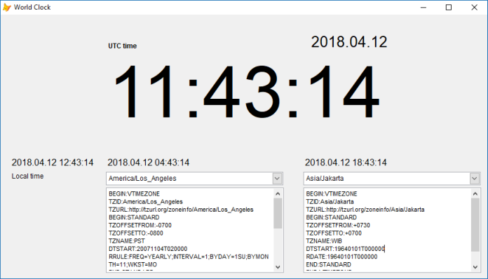

# iCal4VFP :: Examples

Go to

- [Overview](README.md "Overview")
- [Classes](classes.md "Classes")

## Examples

### Programmatically create iCalendar Objects

Creates an `iCalendar` object from scratch, by calling `CREATEOBJECT()` and then adding properties and components.

Recreates the following iCalendar document (from the RFC 5545 specification):

```iCalendar
BEGIN:VCALENDAR
PRODID:-//xyz Corp//NONSGML PDA Calendar Version 1.0//EN
VERSION:2.0
BEGIN:VEVENT
DTSTAMP:19960704T120000Z
UID:uid1@example.com
ORGANIZER:mailto:jsmith@example.com
DTSTART:19960918T143000Z
DTEND:19960920T220000Z
STATUS:CONFIRMED
CATEGORIES:CONFERENCE
SUMMARY:Networld+Interop Conference
DESCRIPTION:Networld+Interop Conference
  and Exhibit\nAtlanta World Congress Center\n
 Atlanta\, Georgia
END:VEVENT
END:VCALENDAR
```

Note how properties are instantiated with their own values. In case of dates, since they all are UTC dates in the example, a flag is passed to the value setting to signal the case.

```foxpro
m.TstEvent.AddICproperty(CREATEOBJECT("iCalPropDTSTAMP", {^1996-07-04 12:00:00}, ICAL_DATE_IS_UTC))
```

[Source](examples/iCalendar-objects.prg "Source")

### Read an iCalendar formatted object

Reads an iCalendar formatted string. The full object is parsed and instantiated as an `iCalendar` VFP object which, in turn, is serialized back as an iCalendar document.

[Source](examples/read-iCalendar-from-memory.prg "Source")

### Import an .ics file into a VFP cursor

Reads an .ics file and imports a simplified version of its events into a VFP Cursor. Use an .ics file in your computer to run the example. The debugger is activated to facilitate the inspection of the generated `iCalendar` object.

Note that the cursor could be created directly from the .ics source file, by calling `ICSToCursor()` with a filename as the first argument.

[Source](examples/icalendar-file-to-cursor.prg "Source")

### Run the RFC 5545 Recurrence Rule examples

Runs the complete set of the 42 Recurrence Rule examples of the [RFC 5545](https://tools.ietf.org/html/rfc5545 "RFC 5545") specification.

`#DEFINE` settings at the beginning of the program control how the example is executed.

[Source](examples/rrfc%205545%20RRULE%20examples.prg "Source")

### Calculate recurrent dates defined as an iCalendar event 

Calculates the pay day defined as

```iCalendar
RRULE:FREQ=MONTHLY;BYDAY=-1MO,-1TU,-1WE,-1TH,-1FR;BYSETPOS=-1
```

(the last week day of a month).

[Source](examples/use%20RRULE%20to%20calculate%20events%20dates.prg "Source")

### UTC to local time from an iCalendar timezone definition

Uses an iCalendar timezone definition for "America/New York" timezone to calculate its local time. Three times are displayed: the local time of the computer running the example (from `DATETIME()`), the UTC current time (from Win32 `GetSystemTime()` function), and New York local time, as calculated by a call to `iCalCompVTIMEZONE.ToLocalTime()` method.

[Source](examples/UTC%20time%20to%20local%20time%20using%20VTIMEZONE.prg "Source")

### Access to the TZURL timezone data

Displays a World Clock with current UTC time, PC's local time, and local time of two timezones that the user can select.



[SCX Source](examples/world-clock.zip "SCX Source") or (Source)[examples/world-clock.sc2 "Source"]


